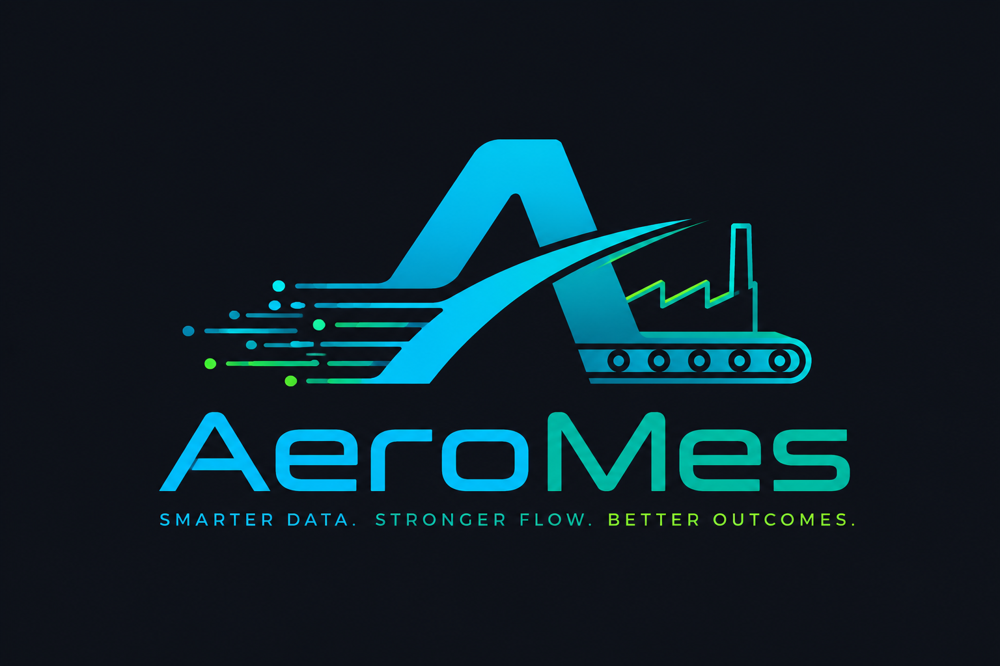

<p align="center">
  
</p>

<p align="center">
  <strong>Smarter Data &nbsp;·&nbsp; Stronger Flow &nbsp;·&nbsp; Better Outcomes</strong>
</p>

<p align="center">
  
  
  
  
  
  
  
  
</p>

<p align="center">
  <strong>Android milestones</strong><br/>
  <a href="https://github.com/thnak/AeroMes/milestone/24"></a>
  <a href="https://github.com/thnak/AeroMes/milestone/25"></a>
  <a href="https://github.com/thnak/AeroMes/milestone/26"></a>
  <a href="https://github.com/thnak/AeroMes/milestone/27"></a>
  <a href="https://github.com/thnak/AeroMes/milestone/28"></a>
  <a href="https://github.com/thnak/AeroMes/milestone/29"></a>
</p>

---

## Overview

**AeroMes** is an open-source Manufacturing Execution System (MES) built on .NET 10 and React 19. It tracks production from work order creation through job execution, downtime logging, and quality recording — giving shop-floor operators and planners a real-time view of what is happening on the line.

## Features

### Production Management
- **Work Orders** — create, start, pause, resume, and complete; full lifecycle with domain events
- **Jobs** — per-operation job execution linked to work orders and routing steps
- **Downtime Tracking** — log and close machine downtime with reason codes
- **Production Logs & Inventory** — record output quantities and update stock in real time

### Master Data
- Products, Bills of Materials (BOM)
- Machines and Work Centers
- Operations and Routings (multi-step)
- Storage Locations

### Quality
- Defect code library with structured defect details

### Integration
- Sales Orders and Production Orders for ERP hand-off

### Android PDA & Tablet OI
Native **Kotlin + Jetpack Compose** app for Newland, Urovo, and Zebra industrial devices (minSdk 31). Covers:
- **Handheld PDA** — GRN receiving, material pick/issue, production qty logging, downtime report, lot lookup, label print/verify, quality inspection, NCR raise
- **Tablet Operator Interface** — full-screen job + SOP + quality panel, station grid, shift handover, supervisor floor board with live OEE and IoT gauges
- Vendor-agnostic **Scanner HAL** (`Flow<ScanEvent>`) with GENERIC (CameraX + ML Kit) fallback for dev phones
- **Offline-first** — Room DB + sync queue; critical scans recorded without network, auto-synced on reconnect

### Security & Identity
- **Dual authentication** — Cookie-based for the web frontend, JWT Bearer for PDA / API clients; both share the same session pipeline
- **Multi-Factor Authentication** — TOTP authenticator apps, Email OTP, and recovery codes
- **Passkeys (WebAuthn)** — passwordless login via hardware keys or platform authenticators
- **Permission-based authorization** — fine-grained per-resource policies, role-level defaults with per-user overrides
- **Refresh tokens** — sliding JWT renewal without re-login
- **Security audit log** — immutable record of authentication and permission events
- **Force password change** and **MFA enforcement** middleware gates

### Developer Experience
- OpenAPI + [Scalar](https://scalar.com) interactive API explorer at `/scalar` in development
- RFC 7807 Problem Details for all errors via `ExceptionMiddleware`
- Auto-migrate and seed on startup (safe for CI / auto-deploy)
- Integration test suite with a real SQL Server via `AeroMesWebFactory`

## Architecture

```
src/
  AeroMes.Api/            ← Controllers, Middleware, Identity, OpenAPI config
  AeroMes.Application/    ← CQRS handlers (MediatR), FluentValidation, interfaces
  AeroMes.Infrastructure/ ← EF Core DbContext, repositories, migrations, Identity store
  AeroMes.Domain/         ← Entities, value objects, domain events, exceptions
web/                      ← Vite + React 19 + MUI v9 frontend
tests/
  AeroMes.IntegrationTests/ ← End-to-end API tests against a real database
```

The solution follows **Clean Architecture**:
- Domain has zero external dependencies
- Application depends only on Domain interfaces
- Infrastructure implements those interfaces; Domain never imports it
- API is the composition root

All writes go through **CQRS commands** (MediatR + `ValidationBehavior`). Errors are thrown as `DomainException` / `EntityNotFoundException` and converted to Problem Details by the middleware — no try/catch in handlers.

## Tech Stack

| Layer | Technology |
|---|---|
| API | ASP.NET Core 10 MVC |
| CQRS | MediatR + FluentValidation |
| ORM | EF Core 10 (SQL Server, JSON columns, soft delete) |
| Identity | ASP.NET Core Identity + custom JWT token service |
| Frontend | React 19 · TypeScript 6 · Vite 8 · MUI v9 |
| Android | Kotlin · Jetpack Compose · Material 3 · Hilt · Coroutines/Flow |
| Scanner HAL | Newland, Urovo, Zebra, GENERIC (CameraX + ML Kit) |
| Android DB | Room (offline-first) · WorkManager (sync queue) |
| Testing | xUnit · integration tests with real SQL Server |
| API Docs | .NET OpenAPI + Scalar |

## Getting Started

### Prerequisites

- [.NET 10 SDK](https://dotnet.microsoft.com/download)
- [Node.js 20+](https://nodejs.org)
- SQL Server (local or Docker)

### 1. Clone

```bash
git clone https://github.com/thnak/AeroMes.git
cd AeroMes
```

### 2. Configure

Copy and edit the API settings:

```bash
cp src/AeroMes.Api/appsettings.json src/AeroMes.Api/appsettings.Development.json
```

Set your connection string and JWT key:

```json
{
  "ConnectionStrings": {
    "DefaultConnection": "Server=localhost;Database=AeroMes;Trusted_Connection=True;"
  },
  "Jwt": {
    "Key": "<your-secret-key-min-32-chars>",
    "Issuer": "AeroMes",
    "Audience": "AeroMes"
  },
  "Cors": {
    "Origins": ["http://localhost:5173"]
  }
}
```

### 3. Run the API

The API migrates the database and seeds initial data on first startup.

```bash
dotnet run --project src/AeroMes.Api
```

API: `https://localhost:7xxx`  
Scalar UI: `https://localhost:7xxx/scalar`

### 4. Run the Frontend

```bash
cd web
npm install
npm run dev
```

Frontend: `http://localhost:5173`

### 5. Run Tests

```bash
dotnet test tests/AeroMes.IntegrationTests
```

## Project Structure (Domain Bounded Contexts)

```
Domain/
  Auth/        ← Permissions, roles, refresh tokens, audit log
  Master/      ← Products, BOM, machines, work centers, operations, routings
  Production/  ← Work orders, jobs, downtime, production logs, inventory
  Quality/     ← Defect codes and details
  Integration/ ← Sales orders and production orders (ERP boundary)
```

## Contributing

1. Fork the repo and create a feature branch
2. Follow the coding standards in `CLAUDE.md` / `.claude/commands/code-style.md`
3. Ensure all integration tests pass before opening a PR

## License

MIT — see [LICENSE](LICENSE) for details.
